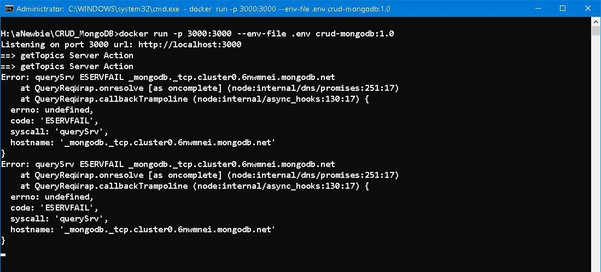

## Dockerization on Windows container

<div style="text-align: right; color:white; background-color:black; font-size: small;">
Have you ever been tempted to try on unorthodox or even unethical things in early adolescence? 
</div>


### Prologue
Previously, we've dockerized [crud-mongodb](https://github.com/Albert0i/crud-mongodb) on linux container. Dockerizing on Windows container is such a challenging task due to intrinsic deficiency and subtle incompatibility, and is a far more difficult way to deploy our app.

Few of us ever try or even know of `Windows container`, ie. a kind of container inside which  windows compatible binaries are run. Windows container is such a *niche market* that scarcely no useful resource could be found without tremendous endeavour. Enjoy this fantastic voyage if you are a windows maniac (like me)... 


### I. [Output Options](https://nextjs.org/docs/pages/api-reference/next-config-js/output#automatically-copying-traced-files)
The whole thing hinges on `standalone` mode as described in official documentations. 

> Next.js can automatically create a standalone folder that copies only the necessary files for a production deployment including select files in node_modules.

> To leverage this automatic copying you can enable it in your next.config.js:
next.config.js
```
module.exports = {
  output: 'standalone',
}
```
> This will create a folder at .next/standalone which can then be deployed on its own without installing node_modules.

> Additionally, a minimal server.js file is also output which can be used instead of next start. 

> This minimal server does not copy the public or .next/static folders by default as these should ideally be handled by a CDN instead, although these folders can be copied to the standalone/public and standalone/.next/static folders manually, after which server.js file will serve these automatically.


### II. Dockerfile
Based on [With Docker](https://github.com/vercel/next.js/tree/canary/examples/with-docker), I mimic the steps carefully. The base OS is either `nanoserver:20H2` or `servercore:20H2`. I am in favor of nanoserver for it's smaller in size. 

The elaborated version of our manuscript is like this: 

```
FROM mcr.microsoft.com/windows/nanoserver:20H2 as builder

WORKDIR /app
COPY *.json *.js node-v18.16.1-win-x64.zip ./

# Add NodeJS to search path 
ENV PATH="C:\Windows\system32;C:\Windows;C:\app\node-v18.16.1-win-x64;"
 
# Because we don't have PowerShell, we will install using CURL and TAR
RUN tar.exe -xf node-v18.16.1-win-x64.zip && \
    del node-v18.16.1-win-x64.zip 

COPY actions ./actions 
COPY app ./app
COPY components ./components
COPY libs ./libs 
COPY models ./models 
COPY viewModels/ ./viewModels

RUN npm ci && \
    npm run build 

### 
FROM mcr.microsoft.com/windows/nanoserver:20H2 as runner 

WORKDIR /app
COPY node-v18.16.1-win-x64.zip  ./

# Add NodeJS to search path 
ENV PATH="C:\Windows\system32;C:\Windows;C:\app\node-v18.16.1-win-x64;"

# Because we don't have PowerShell, we will install using CURL and TAR
RUN tar.exe -xf node-v18.16.1-win-x64.zip && \
    del node-v18.16.1-win-x64.zip 

COPY --from=builder /app/.next/standalone .next/standalone
COPY --from=builder /app/.next/static .next/standalone/.next/static
COPY public .next/standalone/public

EXPOSE 3000
ENTRYPOINT ["node", ".next/standalone/server.js"]
```

To build the docker image: 
```
docker build -t crud-mongodb:1.0 . 
```


The build was awful and intolerably slow... Even though I deliberately placed [node-v18.16.1-win-x64.zip](https://nodejs.org/dist/v18.16.1/node-v18.16.1-win-x64.zip) under the root folder to save the repetitive download time. 


### II. Up and running
To give it a shot with: 
```
docker run -p 3000:3000 --env-file .env crud-mongodb:1.0 
```


Since `querySrv ESERVFAIL` is a DNS error, I have to use the older version of MongoDB Compass URL:
For 1.12  or later
```
mongodb+srv://mernuser:<password>@cluster0.6nwmnei.mongodb.net/
```
For 1.11 or earlier
```
mongodb://mernuser:<password>@ac-ldptdhh-shard-00-00.6nwmnei.mongodb.net:27017,ac-ldptdhh-shard-00-01.6nwmnei.mongodb.net:27017,ac-ldptdhh-shard-00-02.6nwmnei.mongodb.net:27017/?replicaSet=atlas-c8lpou-shard-0&ssl=true&authSource=admin
```

After changing the `.env` file and re-run, everything works fine! 


### IV. Bonus 
To leverage our docker image, we need a `docker-compose` and `Makefile` file, so as to bring up the entire *ecology circle*. 

```
version: "3"
services:
  redis:
    build: 
      context: .
    image: 
      crud-mongodb:1.0
    container_name:
        crud-mongodb
    ports:
      - "3000:3000"
    env_file:
      - .env
```


### V. Summary 
Building image for Windows container is an absolute drudgery. I have spent hours and hours to fine-tune `Dockerfile` so as to bring the image to life. The outcome was better than expected in terms of image size as well as number of layers. 


hither and thither,
to and fro,
from stem to stern,
starboard and larboard. 


### V. Reference
1. [Running a Node / Angular Application in a container based on Windows Nano Server](https://kevinsaye.wordpress.com/2019/08/06/running-a-node-angular-application-in-a-container-based-on-windows-nano-server/)
2. [Error: querySrv ESERVFAIL _mongodb._tcp.cluster0.abcd0.mongodb.net](https://stackoverflow.com/questions/68875026/error-querysrv-eservfail-mongodb-tcp-cluster0-abcd0-mongodb-net)
3. [Connect to MongoDB Atlas from Google App Engine](https://stackoverflow.com/questions/51946930/connect-to-mongodb-atlas-from-google-app-engine)
4. [Not able to access internet inside docker windows container](https://stackoverflow.com/questions/59766135/not-able-to-access-internet-inside-docker-windows-container)


### Epilogue 
<div style="text-align: left;">
</div>


### EOF (2023/07/14)
