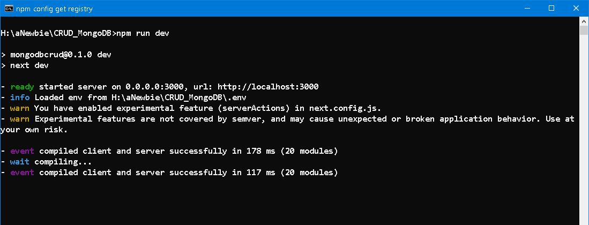
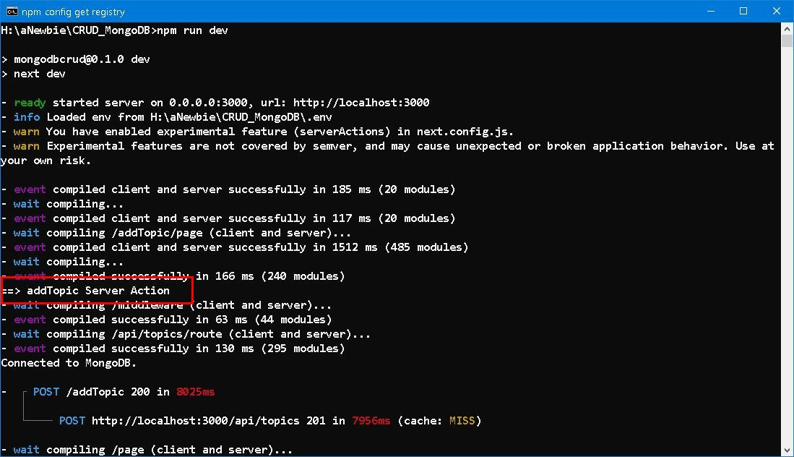
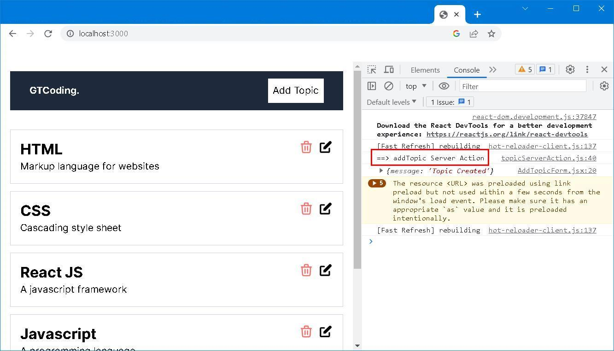
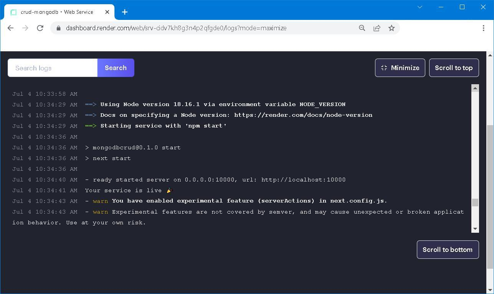

## [NEXT](https://nextjs.org/) to [Node](https://nodejs.org/en)<br /> ── ‘If you are right, I must be wrong!’ 


<div style="text-align: right; color:white; background-color:black; font-size: small;">
‘When I wish to find out how wise, or how stupid, or how good, or how wicked is any one, or what are his thoughts at the moment, I fashion the expression of my face, as accurately as possible, in accordance with the expression of his, and then wait to see what thoughts or sentiments arise in my mind or heart, as if to match or correspond with the expression.’ 
<br/><br/>
─── The Purloined Letter, Edgar Allan Poe
</div>


### Prologue
Being dominated by uncertainity and randomness, *life*, per se, is only a game of unpredictability. Watching carriages come and go in the city, you may easily come to conclusion that they are just too many. But in case of urgency, you will be much agitated by the unavailability even though reluctantly you double the fare. 

It's said that ["time and tide wait for no man"](https://dictionary.cambridge.org/dictionary/english/time-and-tide-wait-for-no-man) and ["The gods send nuts to those who have no teeth"](https://www.oxfordreference.com/display/10.1093/acref/9780199539536.001.0001/acref-9780199539536-e-921). At a certain point of time, any further physical or mental exertion yield futile a nought, I would like to say that it's a matter of time, it's a matter of chance... 


### I. Introduction
With the arrival of [Next.js 13.4](https://nextjs.org/blog/next-13-4), two of the most appealing features are **App Router** and **Server Action**. 

The official [documentation](https://nextjs.org/docs) is awesome... [CSR, SSR, SSG, ISR](https://youtu.be/YkxrbxoqHDw)... lots and lots of jargons... Stop beating around the brushes. Let's come to the point: 

- NextJS, which is based on NodeJS and ReactJS, is *de facto* hybrid of both worlds, and thus inherits many peculiar characteristics from its ancestors.
- By dint of [JSX](https://legacy.reactjs.org/docs/introducing-jsx.html) syntax, it evades utilization of [Template Engines](https://www.tutorialsteacher.com/nodejs/template-engines-for-nodejs) such as [EJS](https://ejs.co/) or [Pug](https://pugjs.org/api/getting-started.html) to produce the final HTML.
- App Router enables the routing defined by the hierarchy of your folders within the app directory (old-school flavour) plus flexible dynamic routing mechanism. 
- Server Action enables client-side javascript calling functions on server directly without needing to create an API layer in-between. 
- [page.js, loading.js, not-found.js, error.js, route.js](https://nextjs.org/docs/app/api-reference/file-conventions) have *semantic* meanings inside a folder. There's no such thing as `server.js` but [Serverless Functions](https://vercel.com/docs/concepts/functions/serverless-functions). 
- Owing to security reasons, all components are *server first* by default. 
- By inserting a **"use client"** or **"use server"** in the beginning of a file or in topmost position within a function definition. You evince the intention of behaviour change.
- As you may know, ReactJS and Tailwindcss needs a build step and so does NextJS.

Using [this repository](https://github.com/Godsont/CRUD_MongoDB), we can quickly bring the project to live and start our voyage...


### II. [Server Actions](https://nextjs.org/docs/app/building-your-application/data-fetching/server-actions)
First things first, you need to modify `next.config.js`: 

next.config.js
```javascript
/** @type {import('next').NextConfig} */
const nextConfig = {
  experimental: {
    serverActions: true,
  },
}

module.exports = nextConfig
```
to enable server actions features. 



Bear in your mind, Server Actions MUST be async functions. I slightly re-factor the source tree to accommodate server actions. 

AddTopicForm.jsx
```
"use client";
import { addTopic } from '@/actions/topicServerAction'
. . . 
const onSubmit = ( data ) => {
    setDisabled('disabled')
    addTopic(data.title, data.description)
      .then(res => {
        console.log(res)
        router.refresh()
        router.push('/')
      })
      .catch(err => console.log(err)) 
  };
. . . 
```
topicServerAction.js
```
"use server"
. . . 
export const addTopic = async (title, description) => {
    console.log('addTopic Server Action')
    . . .     
}
. . . 
```



Message is printed out on the server console. However, taking off the "use server" and re-execute. 



Message is printed out on browser console. 


### III. Deploy with [PM2](https://pm2.keymetrics.io/)
(to be continue...)


### IV. Deploy with [Docker](https://www.docker.com/)
According to official [deployment documentation](https://nextjs.org/docs/pages/building-your-application/deploying#docker-image) and mainly [With Docker](https://github.com/vercel/next.js/tree/canary/examples/with-docker), I slightly modify the Dockerfile to match my development environment: 

```
FROM node:18.16.1-alpine3.17 AS base

# Install dependencies only when needed
FROM base AS deps
# Check https://github.com/nodejs/docker-node/tree/b4117f9333da4138b03a546ec926ef50a31506c3#nodealpine to understand why libc6-compat might be needed.
RUN apk add --no-cache libc6-compat
WORKDIR /app

# Install dependencies based on the preferred package manager
COPY package.json package-lock.json* ./
RUN npm ci

# Rebuild the source code only when needed
FROM base AS builder
WORKDIR /app
COPY --from=deps /app/node_modules ./node_modules
COPY . .

# Next.js collects completely anonymous telemetry data about general usage.
# Learn more here: https://nextjs.org/telemetry
# Uncomment the following line in case you want to disable telemetry during the build.
ENV NEXT_TELEMETRY_DISABLED 1

RUN npm run build

# Production image, copy all the files and run next
FROM base AS runner
WORKDIR /app

ENV NODE_ENV development
ENV NODE_VERSION 18.16.1
# Uncomment the following line in case you want to disable telemetry during runtime.
ENV NEXT_TELEMETRY_DISABLED 1

RUN addgroup --system --gid 1001 nodejs
RUN adduser --system --uid 1001 nextjs

COPY --from=builder /app/public ./public

# Automatically leverage output traces to reduce image size
# https://nextjs.org/docs/advanced-features/output-file-tracing
COPY --from=builder --chown=nextjs:nodejs /app/.next/standalone ./
COPY --from=builder --chown=nextjs:nodejs /app/.next/static ./.next/static

USER nextjs

EXPOSE 3000

ENV PORT 3000

CMD ["node", "server.js"]
```

Then modify `next.config.js` as follow:
```
/** @type {import('next').NextConfig} */
const nextConfig = {
    experimental: {
        serverActions: true,
      },

    output: 'standalone'
}

module.exports = nextConfig
```

To build the docker image: 
```
docker build -t crud-mongodb:1.0 .
```


To give it a shot with: 
```
docker run -p 3000:3000 --env-file .env crud-mongodb:1.0
```


### V. Deploy to [render.com](https://render.com/)
Create a new **Web Service** by connecting to your [Git](https://github.com/) repository: 

#### Settings 
- Name: &lt;Your Web Service name&gt; 
- Region: &lt;Your favourite region&gt; 
- Branch: `main`
- Runtime: `Node`
- Build Command: `npm install && npm run build` 
- Start Command: `npm start`
- Auto-Deploy: Choose `No`, choose `Yes` will trigger re-deployment upon every update to your Git repository.

#### Environment
- MONGODB_URI: &lt;Your MongoDB connection string&gt; 
- API_URL: &lt;Your host name&gt;/api
- NODE_VERSION: `18.16.1`
- APP_ENV: `render.com`

By default, Render uses Node version [14.17.0](https://render.com/docs/node-version). Specify an environment variable called `NODE_VERSION` to match your local development version proved to be crucial. (check with `node -v`)



[Live demo](https://crud-mongodb-wa9a.onrender.com)

>Free instance types will spin down with inactivity. Upgrade to a paid instance type to prevent this behavior. 


### VI. Retrospection 
It's said that ["There is nothing new under the sun."](https://en.wiktionary.org/wiki/there_is_nothing_new_under_the_sun), I feel hundred percent true especially when re-reading the article [Calling an ASP.NET C# Method (Web Method) Using JavaScript](https://www.c-sharpcorner.com/UploadFile/abhikumarvatsa/calling-an-Asp-Net-C-Sharp-method-web-method-using-javascript/): 

- ASP.NET WebForm has no routing mechanism at all, every URL strictly align with source directory structure and there is no whatsoever dynamic routing. 
- PageMethods are Server Actions
```
[WebMethod]  
ublic static string ProcessIT(string name, string address)  
{  
   string result = "Welcome Mr. " + name + ". Your address is '" + address + "'.";  
   return result;  
}  
```
- By Enabling PageMethod in ScriptManager, an API is generated and send to the browser
```
<asp:ScriptManager ID="ScriptManager1" runat="server" EnablePageMethods="true">
</asp:ScriptManager>  
```
- Using javascript to call function on the server. 
```
<script type="text/javascript">  
    function HandleIT() {  
        var name = document.getElementById('<%=txtname.ClientID %>').value;  
        var address = document.getElementById('<%=txtaddress.ClientID %>').value;  

        PageMethods.ProcessIT(name, address, onSucess, onError);   
        function onSucess(result) {  
            alert(result);  
        }  

        function onError(result) {  
            alert('Something wrong.');  
        }  
    }  
   </script>  
```

*It is a catch, isn't it?*


### VII. Reference
1. [Server Actions: NextJS 13.4's Best New Feature](https://youtu.be/czvSZqnpTHs)
2. [Next.js Server Actions in 15 min](https://youtu.be/g1dwTNxGmFQ)
3. [Step-by-Step Guide: Create a Next.js 13 CRUD App with MongoDB from Scratch](https://youtu.be/wNWyMsrpbz0)
4. [NEXTjs Server Actions](https://nextjs.org/docs/app/building-your-application/data-fetching/server-actions)
5. [NEXTjs | Data Fetching](https://nextjs.org/docs/app/building-your-application/data-fetching)
6. [How to enable cors in Nextjs 13 Route Handlers](https://github.com/vercel/next.js/discussions/47933)
7. [How to Deploy Nextjs Web Application with PM2](https://dykraf.com/blog/deploying-nextjs-web-application-with-pm2)
8. [Creating a Docker Image of Your Nextjs App](https://www.locofy.ai/blog/create-a-docker-image-of-your-nextjs-app)
9. [With Docker - Multiple Deployment Environments](https://github.com/vercel/next.js/tree/canary/examples/with-docker-multi-env)
10. [Deploy a Next.js App](https://render.com/docs/deploy-nextjs-app)
11. [How to Configure Next.Js Image Hostname](https://postsrc.com/code-snippets/how-to-configure-nextjs-image-hosting)
12. [The Purloined Letter](https://poemuseum.org/the-purloined-letter/)


### Epilogue 

A **Procrustean bed** is a metaphor derived from Greek mythology, specifically the story of Procrustes, a rogue blacksmith and bandit who had an iron bed in his lair. Procrustes would capture unsuspecting travelers and force them to lie on the bed. If the victims were too long for the bed, he would amputate their limbs, and if they were too short, he would stretch them until they fit.

The term "Procrustean bed" has come to symbolize any situation in which a rigid standard or solution is applied, regardless of the specific circumstances or individual differences. In essence, it represents a one-size-fits-all approach that can be harmful or counterproductive when applied without considering the unique aspects of a particular situation or person.

For example, a Procrustean bed might refer to the insistence on using a particular management style or educational approach for all employees or students, even when it's clear that different individuals might benefit from different approaches.

─── ChatGPT-4 


### EOF (2023/07/14)
