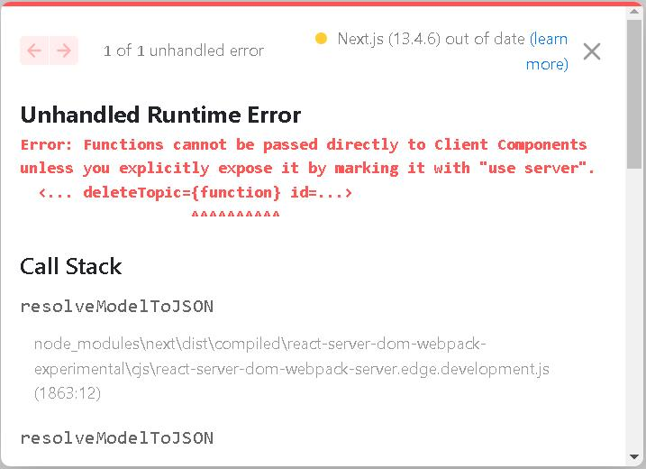

## [NEXT](https://nextjs.org/) to [Node](https://nodejs.org/en)<br /> ── ‘If you are right, I must be wrong!’ 


<div style="text-align: right; color:white; background-color:black; font-size: small;">
‘When I wish to find out how wise, or how stupid, or how good, or how wicked is any one, or what are his thoughts at the moment, I fashion the expression of my face, as accurately as possible, in accordance with the expression of his, and then wait to see what thoughts or sentiments arise in my mind or heart, as if to match or correspond with the expression.’ 
<br/><br/>
─── The Purloined Letter, Edgar Allan Poe
</div>


### Prologue
Being dominated by uncertainity and randomness, *life*, per se, is only a game of unpredictability. Watching carriages come and go in the city, you may easily come to conclusion that they are just too many. But in case of urgency, you will be much agitated by the unavailability even though reluctantly you double the fare. 

It's said that ["time and tide wait for no man"](https://dictionary.cambridge.org/dictionary/english/time-and-tide-wait-for-no-man) and ["The gods send nuts to those who have no teeth"](https://www.oxfordreference.com/display/10.1093/acref/9780199539536.001.0001/acref-9780199539536-e-921). At a certain point of time, any further physical or mental exertion yield fruitless and infertile naught, I would like to say that it's a matter of time, it's a matter of chance... 


### I. Introduction
With the arrival of [Next.js 13.4](https://nextjs.org/blog/next-13-4), two of the most appealing features are **App Router** and **Server Action**. 

The official [documentation](https://nextjs.org/docs) is awesome... CSR, SSR, SSG, ISR... lots and lots of [jargons](https://www.flavienbonvin.com/data-building-strategy-for-nextjs-app/)... Stop beating around the brushes. Let's come to the point: 

- NextJS, which is based on NodeJS and ReactJS, is *de facto* hybrid of both worlds, and thus inherits many peculiar characteristics from its ancestors.
- By dint of [JSX](https://legacy.reactjs.org/docs/introducing-jsx.html) syntax, it evades utilization of [Template Engines](https://www.tutorialsteacher.com/nodejs/template-engines-for-nodejs) such as [EJS](https://ejs.co/) or [Pug](https://pugjs.org/api/getting-started.html) to produce the final HTML.
- App Router enables the routing defined by the hierarchy of your folders within the app directory (old-school flavour) plus flexible dynamic routing mechanism. 
- Server Action enables client-side javascript calling functions on server directly without needing to create an API layer in-between. 
- [page.js, loading.js, not-found.js, error.js, route.js](https://nextjs.org/docs/app/api-reference/file-conventions) have *semantic* meanings inside a folder. There's no such thing as `server.js` but [Serverless Functions](https://vercel.com/docs/concepts/functions/serverless-functions). 
- Owing to security reasons, all components are *server first* by default. 
- By inserting a **"use client"** or **"use server"** in the beginning of a file or in topmost position within a function definition. You evince the intention of behaviour change.
- As you may know, ReactJS and Tailwindcss needs a build step and so does NextJS.

Using [this repository](https://github.com/Godsont/CRUD_MongoDB), we can quickly bring the project to live and start our voyage...


### II. [Server Actions](https://nextjs.org/docs/app/building-your-application/data-fetching/server-actions)

First things first, you need to modify `next.config.js`: 

next.config.js
```javascript
/** @type {import('next').NextConfig} */
const nextConfig = {
  experimental: {
    serverActions: true,
  },
}

module.exports = nextConfig
```
to enable server actions features. 


I slightly re-factor the source tree to accommodate server actions. 

AddTopicForm.jsx
```
"use client";
import { addTopic } from '@/actions/topicServerAction'
. . . 
const onSubmit = ( data ) => {
    setDisabled('disabled')
    addTopic(data.title, data.description)
      .then(res => {
        console.log(res)
        router.refresh()
        router.push('/')
      })
      .catch(err => console.log(err)) 
  };
. . . 
```
topicServerAction.js
```
"use server"
. . . 
export const addTopic = async (title, description) => {
    console.log('addTopic Server Action')
    . . .     
}
. . . 
```


By removing the "use server" from topicServerAction.js and re-execute. 


### III. Summary 

[Calling an ASP.NET C# Method (Web Method) Using JavaScript](https://www.c-sharpcorner.com/UploadFile/abhikumarvatsa/calling-an-Asp-Net-C-Sharp-method-web-method-using-javascript/)

But there is a catch, isn't it? 




### IV. Reference
1. [Server Actions: NextJS 13.4's Best New Feature](https://youtu.be/czvSZqnpTHs)
2. [Next.js Server Actions in 15 min](https://youtu.be/g1dwTNxGmFQ)
3. [Step-by-Step Guide: Create a Next.js 13 CRUD App with MongoDB from Scratch](https://youtu.be/wNWyMsrpbz0)
4. [NEXTjs Server Actions](https://nextjs.org/docs/app/building-your-application/data-fetching/server-actions)
5. [NEXTjs | Data Fetching](https://nextjs.org/docs/app/building-your-application/data-fetching)
6. [How to enable cors in Nextjs 13 Route Handlers](https://github.com/vercel/next.js/discussions/47933)
7. [How to Deploy Nextjs Web Application with PM2](https://dykraf.com/blog/deploying-nextjs-web-application-with-pm2)
8. [With Docker - Multiple Deployment Environments](https://github.com/vercel/next.js/tree/canary/examples/with-docker-multi-env)
9. [Deploy a Next.js App](https://render.com/docs/deploy-nextjs-app)
10. [The Purloined Letter](https://poemuseum.org/the-purloined-letter/)


### Epilogue 

A **Procrustean bed** is a metaphor derived from Greek mythology, specifically the story of Procrustes, a rogue blacksmith and bandit who had an iron bed in his lair. Procrustes would capture unsuspecting travelers and force them to lie on the bed. If the victims were too long for the bed, he would amputate their limbs, and if they were too short, he would stretch them until they fit.

The term "Procrustean bed" has come to symbolize any situation in which a rigid standard or solution is applied, regardless of the specific circumstances or individual differences. In essence, it represents a one-size-fits-all approach that can be harmful or counterproductive when applied without considering the unique aspects of a particular situation or person.

For example, a Procrustean bed might refer to the insistence on using a particular management style or educational approach for all employees or students, even when it's clear that different individuals might benefit from different approaches.

─── ChatGPT-4 


### EOF (2023/06/30)
